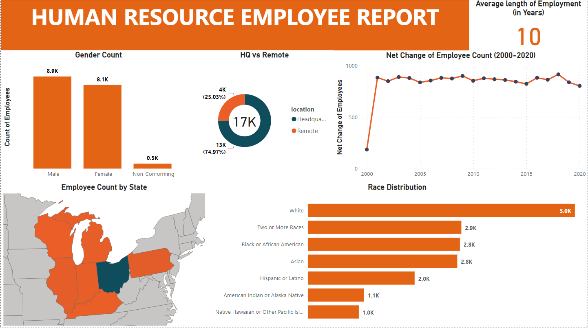

# Employee Workforce Analytics Project Readme

## Introduction

This readme file provides an overview of the Employee Workforce Analytics project, including the data set, tools, and steps for analysis. The project aims to help the company understand its employee workforce better, identify trends, and make data-driven decisions to improve HR strategies.

## Table of Contents

1. [Project Overview](#project-overview)
2. [Data Set](#data-set)
3. [Tools and Technologies](#tools-and-technologies)
4. [Analysis Steps](#analysis-steps)
5. [Visualizations](#visualizations)
6. [Conclusion](#conclusion)
   

---

## 1. Project Overview

The Employee Workforce Analytics project is designed to provide insights into the company's employee data. By leveraging MySQL for data processing and Power BI for visualization, this project aims to help the company make informed decisions regarding workforce management, performance, and retention.

## 2. Data Set

The dataset provided for this project contains employee information, including but not limited to:

- Employee ID
- Name
- Department
- Job Title
- Joining Date
  
## 3. Tools and Technologies

To perform the analysis, we will use the following tools and technologies:

- **MySQL:** This relational database management system will be used to store, manage, and query the employee data.

- **Power BI:** This business intelligence tool will be employed for data visualization, creating insightful reports, and dashboards.

Please ensure that you have access to both MySQL and Power BI or equivalent tools for this project.

## 4. Analysis Steps

The following steps outline the process for conducting the employee workforce analytics:

1. **Data Import:** Import the provided dataset into a MySQL database. Create appropriate tables and ensure data integrity.

2. **Data Cleaning:** Clean and preprocess the data to handle missing values, outliers, and any other data quality issues.

3. **Exploratory Data Analysis (EDA):** Perform initial EDA to understand the data distribution, identify trends, and gather descriptive statistics.

4. **Feature Engineering:** Create new features or transform existing ones if needed for better insights.

5. **Data Visualization:** Connect MySQL to Power BI, import the data, and create visualizations to represent key metrics, such as attrition rates, performance trends, and salary distributions.

6. **Insight Generation:** Use the visualizations to draw insights and make recommendations based on the data analysis.

7. **Report Creation:** Develop detailed reports and dashboards in Power BI that communicate findings effectively.

## 5. Visualizations

In Power BI, you can create various types of visualizations, including bar charts, line graphs, pie charts, and heat maps. Customize the visuals to fit the specific metrics and trends you want to showcase.

## 6. Findings

Based on the analysis of The Employee Workforce Analytics project, we have uncovered several key insights that can provide valuable support for HR decision-making. Here is a conclusion summarizing the findings:

1. **Gender Breakdown**: The workforce is categorized into three gender categories: Male, Female, and Non-Conforming. Males make up the largest proportion, while the Non-Conforming group represents a relatively small percentage of the workforce.

2. **Race/Ethnicity Diversity**: There are about seven different ethnicities represented in the employee population, with the majority being White. This suggests that there may be room for improvement in increasing diversity and inclusion.

3. **Age Distribution**: The age distribution of employees is highest within the 35-44 age range, indicating a significant portion of the workforce falls within this bracket.

4. **Location Distribution**: Approximately 75% of employees work at the headquarters, which suggests a concentration of the workforce in a specific location. This may have implications for resource allocation and remote work policies.

5. **Average Tenure of Terminated Employees**: The average length of employment for terminated employees is 10 years, which may warrant further investigation into the reasons for termination and the potential for employee retention efforts.

6. **Gender Balance in Departments**: There appears to be a slight gender balance in each department, with males slightly outnumbering females by 2% on average. This suggests a generally equitable distribution of gender within various departments.

7. **Turnover Rate by Department**: The Auditing department has the highest turnover rate, which may necessitate HR intervention to understand and address the causes of turnover in this specific department.

8. **Location of Employees**: The majority of employees reside in Ohio, while the lowest number live in Kentucky. This information could be important for considering regional factors and workforce planning.

9. **Employee Count Trend**: Over time, there has been an increase in the employee count between 2000 and 2020. This growth may be indicative of the company's expansion or success during this period.

## 7. Conclusion

In conclusion, the analysis highlights several key aspects of the employee workforce, including gender distribution, age, ethnicity, location, tenure, and departmental dynamics. This information can be instrumental in making informed HR decisions. Areas that may require attention include promoting diversity, addressing turnover in the Auditing department, and understanding the reasons behind terminations. Furthermore, the historical growth in employee count suggests positive trends for the organization's overall development. These findings can serve as a foundation for HR strategies and policies to improve workforce management and promote inclusivity and retention.
