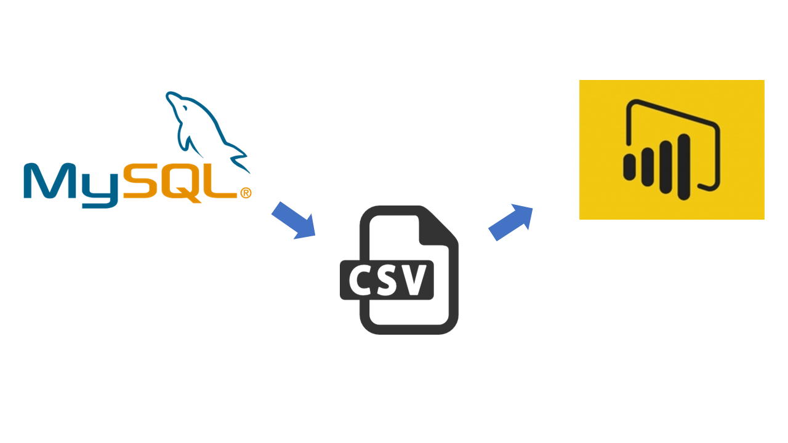

# Employee Workforce Analytics Project Readme

## Introduction

This readme file provides an overview of the Employee Workforce Analytics project, including the data set, tools, and steps for analysis. The project aims to help the company understand its employee workforce better, identify trends, and make data-driven decisions to improve HR strategies.

## Table of Contents

1. [Project Overview](#project-overview)
2. [Data Set](#data-set)
3. [Tools and Technologies](#tools-and-technologies)
4. [Analysis Steps](#analysis-steps)
5. [Visualizations](#visualizations)
6. [Conclusion](#conclusion)
   

---

## 1. Project Overview

The Employee Workforce Analytics project is designed to provide insights into the company's employee data. By leveraging MySQL for data processing and Power BI for visualization, this project aims to help the company make informed decisions regarding workforce management, performance, and retention.

## 2. Data Set

The dataset provided for this project contains employee information, including but not limited to:

- Employee ID
- Name
- Department
- Job Title
- Joining Date
  
## 3. Tools and Technologies

To perform the analysis, we will use the following tools and technologies:

- **MySQL:** This relational database management system will be used to store, manage, and query the employee data.

- **Power BI:** This business intelligence tool will be employed for data visualization, creating insightful reports, and dashboards.

Please ensure that you have access to both MySQL and Power BI or equivalent tools for this project.

## 4. Analysis Steps

The following steps outline the process for conducting the employee workforce analytics:

1. **Data Import:** Import the provided dataset into a MySQL database. Create appropriate tables and ensure data integrity.

2. **Data Cleaning:** Clean and preprocess the data to handle missing values, outliers, and any other data quality issues.

3. **Exploratory Data Analysis (EDA):** Perform initial EDA to understand the data distribution, identify trends, and gather descriptive statistics.

4. **Feature Engineering:** Create new features or transform existing ones if needed for better insights.

5. **Data Visualization:** Connect MySQL to Power BI, import the data, and create visualizations to represent key metrics, such as attrition rates, performance trends, and salary distributions.

6. **Insight Generation:** Use the visualizations to draw insights and make recommendations based on the data analysis.

7. **Report Creation:** Develop detailed reports and dashboards in Power BI that communicate findings effectively.

## 5. Visualizations

In Power BI, you can create various types of visualizations, including bar charts, line graphs, pie charts, and heat maps. Customize the visuals to fit the specific metrics and trends you want to showcase.

## 6. Conclusion

The Employee Workforce Analytics project aims to provide valuable insights to support HR decisions. 
